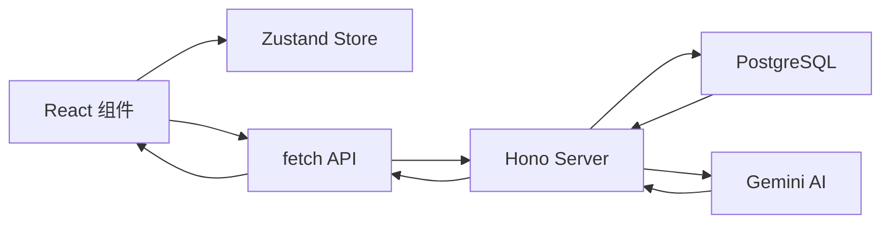

# Design Document: PackGenius AI 全面重构

## Overview

本次重构采用**精简全栈架构**，在保持快速开发的同时实现前后端分离。核心原则：
- **够用就好** - 不过度设计，按需扩展
- **单仓库** - 前后端在同一仓库，共享类型定义
- **轻量后端** - Hono + PostgreSQL，简洁高效
- **简单状态** - Zustand 管理本地状态，fetch 直接调用 API

## Architecture

### 目录结构

```
packgenius-ai/
├── frontend/                # 前端应用
│   ├── src/
│   │   ├── components/      # 组件
│   │   │   ├── ui/          # shadcn/ui 基础组件
│   │   │   ├── BoxVisualizer.tsx
│   │   │   ├── InventoryEditor.tsx
│   │   │   ├── LogicGuide.tsx
│   │   │   └── ResultDisplay.tsx
│   │   ├── hooks/           # 自定义 Hooks
│   │   │   ├── use-packaging.ts
│   │   │   ├── use-inventory.ts
│   │   │   └── use-translation.ts
│   │   ├── stores/          # Zustand Store
│   │   │   └── packaging-store.ts
│   │   ├── lib/             # 工具
│   │   │   ├── api.ts
│   │   │   ├── utils.ts
│   │   │   └── constants.ts
│   │   ├── i18n/            # 国际化
│   │   │   ├── en.json
│   │   │   └── zh-CN.json
│   │   ├── types.ts
│   │   ├── App.tsx
│   │   ├── main.tsx
│   │   └── index.css
│   ├── components.json      # shadcn/ui 配置
│   ├── tailwind.config.js
│   ├── tsconfig.json
│   ├── vite.config.ts
│   └── package.json
│
├── backend/                 # 后端应用
│   ├── src/
│   │   ├── index.ts         # 入口 + 路由
│   │   ├── db.ts            # PostgreSQL 连接
│   │   ├── packaging.ts     # 计算逻辑
│   │   └── ai.ts            # AI 服务
│   ├── tsconfig.json
│   └── package.json
│
├── package.json             # workspace root
├── .env                     # 环境变量
└── README.md
```

### 数据流架构（精简版）



### API 设计（精简版）

| Method | Endpoint | Description |
|--------|----------|-------------|
| GET | `/api/inventory` | 获取库存列表 |
| POST | `/api/inventory` | 添加/批量导入 |
| DELETE | `/api/inventory/:id` | 删除纸箱 |
| POST | `/api/calculate` | 计算 + AI 分析 |

### 数据库设计（PostgreSQL）

```sql
CREATE TABLE IF NOT EXISTS inventory (
  id VARCHAR(50) PRIMARY KEY,
  length DECIMAL(10,2) NOT NULL,
  width DECIMAL(10,2) NOT NULL,
  height DECIMAL(10,2) NOT NULL,
  created_at TIMESTAMP DEFAULT CURRENT_TIMESTAMP
);
```

### 技术选型理由

| 选择 | 理由 |
|------|------|
| **Hono** | 比 Express 更轻量，TypeScript 原生支持，API 简洁 |
| **PostgreSQL** | 功能强大、支持高并发、云服务丰富（Supabase/Neon/Railway） |
| **postgres (porsager/postgres)** | 轻量级 PostgreSQL 客户端，无 ORM 开销 |
| **Zustand** | 比 Redux 简单 10 倍，无 boilerplate |
| **直接 fetch** | 简单场景无需 React Query，减少依赖 |
| **shadcn/ui** | 可复制源码，完全可控，无运行时依赖 |

### PostgreSQL 部署选项

| 服务 | 特点 | 免费额度 |
|------|------|----------|
| **Supabase** | 全托管、自带 Auth/Storage | 500MB 数据库 |
| **Neon** | Serverless、按需扩展 | 512MB 存储 |
| **Railway** | 一键部署、简单易用 | $5/月额度 |
| **本地 Docker** | 开发测试用 | 免费 |

## Components and Interfaces

### 1. 后端 API（Hono 路由）

```typescript
// backend/src/index.ts
import { Hono } from 'hono';
import { cors } from 'hono/cors';

const app = new Hono();
app.use('/*', cors());

// 库存 API
app.get('/api/inventory', async (c) => {
  const items = await db.getAll();
  return c.json(items);
});
app.post('/api/inventory', async (c) => {
  const body = await c.req.json();
  const result = await db.insert(body);
  return c.json(result);
});
app.delete('/api/inventory/:id', async (c) => {
  await db.delete(c.req.param('id'));
  return c.json({ success: true });
});

// 计算 API（包含 AI 分析）
app.post('/api/calculate', async (c) => {
  const { product, config } = await c.req.json();
  const inventory = await db.getAll();
  const result = findBestBox(product, inventory, config);
  const aiAnalysis = await getAIRecommendation(product, result);
  return c.json({ result, aiAnalysis });
});
```

### 2. 前端 Zustand Store

```typescript
// frontend/src/stores/packaging-store.ts
interface PackagingStore {
  // 输入
  product: Dimensions;
  config: PackagingConfig;
  language: Language;
  
  // 结果
  result: CalculationResult | null;
  aiAnalysis: AIAnalysis | null;
  isLoading: boolean;
  
  // Actions
  setProduct: (dims: Partial<Dimensions>) => void;
  setConfig: (cfg: Partial<PackagingConfig>) => void;
  setLanguage: (lang: Language) => void;
  calculate: () => Promise<void>;
  reset: () => void;
}

export const usePackagingStore = create<PackagingStore>((set, get) => ({
  // ... 实现
  calculate: async () => {
    set({ isLoading: true });
    const { product, config } = get();
    const res = await api.post('/api/calculate', { product, config });
    set({ result: res.result, aiAnalysis: res.aiAnalysis, isLoading: false });
  },
}));
```

### 3. 前端 API 封装

```typescript
// frontend/src/lib/api.ts
const BASE = '/api';

export const api = {
  get: async <T>(url: string): Promise<T> => {
    const res = await fetch(BASE + url);
    return res.json();
  },
  post: async <T>(url: string, data: unknown): Promise<T> => {
    const res = await fetch(BASE + url, {
      method: 'POST',
      headers: { 'Content-Type': 'application/json' },
      body: JSON.stringify(data),
    });
    return res.json();
  },
  delete: async (url: string) => {
    await fetch(BASE + url, { method: 'DELETE' });
  },
};
```

### 4. shadcn/ui 组件清单（精简）

| 组件 | 用途 |
|------|------|
| Button | 按钮 |
| Input | 输入框 |
| Card | 卡片容器 |
| Dialog | 弹窗 |
| Tooltip | 提示 |
| Label | 标签 |
| Sonner | Toast 通知 |

## Data Models

### 类型定义（frontend/src/types.ts）

```typescript
// 基础尺寸
export interface Dimensions {
  length: number;
  width: number;
  height: number;
}

// 排列配置
export interface Arrangement {
  l: number;
  w: number;
  h: number;
}

// 包装配置
export interface PackagingConfig {
  innerArrangement: Arrangement;
  masterArrangement: Arrangement;
  innerWallThickness: number;
}

// 库存纸箱
export interface BoxItem extends Dimensions {
  id: string;
  createdAt?: string;
}

// 计算结果
export interface CalculationResult {
  box: BoxItem;
  isCustom: boolean;
  gapL: number;
  gapW: number;
  gapH: number;
  wasteVolume: number;
  innerBoxDims: Dimensions;
  masterPayloadDims: Dimensions;
  totalItems: number;
}

// AI 分析结果
export interface AIAnalysis {
  recommendation: string;
  materialSuggestion: string;
  efficiencyScore: number;
  reasoning: string[];
}

// 语言类型
export type Language = 'en' | 'zh-CN';
```

## Correctness Properties

*A property is a characteristic or behavior that should hold true across all valid executions of a system-essentially, a formal statement about what the system should do. Properties serve as the bridge between human-readable specifications and machine-verifiable correctness guarantees.*

### Property 1: 产品尺寸状态更新一致性
*For any* 有效的产品尺寸输入（length > 0, width > 0, height > 0），通过 store action 更新后，store 中的 productDims 应与输入值完全一致。
**Validates: Requirements 2.2**

### Property 2: 包装配置状态更新一致性
*For any* 有效的包装配置（arrangement 各维度 >= 1, innerWallThickness >= 0），通过 store action 更新后，store 中的 config 应与输入值完全一致。
**Validates: Requirements 2.3**

### Property 3: 计算结果存储完整性
*For any* 有效的计算输入，计算完成后 store 中的 result 应包含所有必需字段且数值正确。
**Validates: Requirements 2.4**

### Property 4: 翻译 key 映射完整性
*For any* 翻译 key，useTranslation hook 在任意支持的语言下都应返回非空字符串。
**Validates: Requirements 4.2**

### Property 5: 包装计算结果正确性
*For any* 有效的产品尺寸、库存列表和包装配置，usePackaging hook 返回的结果应满足：
- innerBoxDims = (product × innerArrangement) + innerWallThickness
- masterPayloadDims = innerBoxDims × masterArrangement
- totalItems = innerArrangement.l × w × h × masterArrangement.l × w × h
**Validates: Requirements 5.1, 7.1**

### Property 6: 库存匹配逻辑正确性
*For any* 计算场景，当库存中存在尺寸 >= (masterPayload + safetyGap) 的纸箱时，结果的 isCustom 应为 false。
**Validates: Requirements 7.2**

### Property 7: 定制纸箱生成逻辑正确性
*For any* 计算场景，当库存中不存在满足条件的纸箱时，结果的 isCustom 应为 true，且 box 尺寸应等于 masterPayload + safetyGap。
**Validates: Requirements 7.3**

### Property 8: CSV 解析正确性
*For any* 格式正确的 CSV 字符串（每行 4 个逗号分隔值），useInventory hook 应解析出对应数量的 BoxItem，且每个 item 的属性值与 CSV 中的值一致。
**Validates: Requirements 5.3, 7.5**

## Error Handling

| 场景 | 处理方式 |
|------|----------|
| API 请求失败 | try/catch + Toast 提示 |
| 无效输入 | 禁用按钮 + 表单验证 |
| AI 失败 | 返回计算结果，aiAnalysis 为 null |
| 数据库错误 | 返回 500 + 错误信息 |

## Testing Strategy

使用 Vitest + fast-check 进行测试，聚焦核心计算逻辑：

```typescript
// backend/src/packaging.test.ts
import fc from 'fast-check';
import { findBestBox } from './packaging';

// **Feature: full-refactor, Property 5: 包装计算结果正确性**
// **Validates: Requirements 5.1, 9.1**
test('packaging calculation produces correct dimensions', () => {
  fc.assert(
    fc.property(
      fc.record({
        length: fc.integer({ min: 1, max: 1000 }),
        width: fc.integer({ min: 1, max: 1000 }),
        height: fc.integer({ min: 1, max: 1000 }),
      }),
      fc.record({
        innerArrangement: fc.record({
          l: fc.integer({ min: 1, max: 10 }),
          w: fc.integer({ min: 1, max: 10 }),
          h: fc.integer({ min: 1, max: 10 }),
        }),
        masterArrangement: fc.record({
          l: fc.integer({ min: 1, max: 10 }),
          w: fc.integer({ min: 1, max: 10 }),
          h: fc.integer({ min: 1, max: 10 }),
        }),
        innerWallThickness: fc.integer({ min: 0, max: 10 }),
      }),
      (product, config) => {
        const result = findBestBox(product, [], config);
        expect(result.innerBoxDims.length).toBe(
          product.length * config.innerArrangement.l + config.innerWallThickness
        );
      }
    ),
    { numRuns: 100 }
  );
});
```

### 测试范围

| 模块 | 测试类型 |
|------|----------|
| `backend/src/packaging.ts` | 属性测试 |
| `backend/src/db.ts` | 单元测试 |
| API 路由 | 集成测试（可选） |
